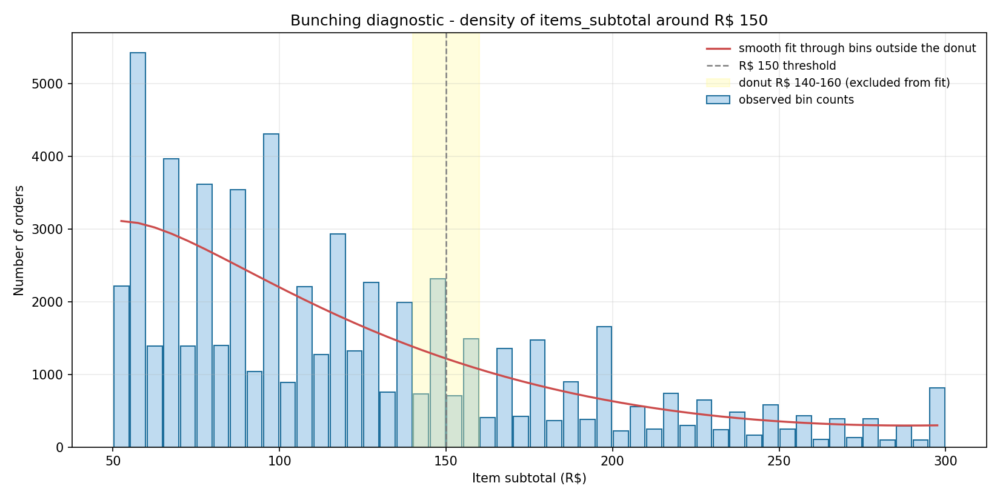

# Bunching diagnostic at R$ 150 threshold

**What this test asks.** In a *real* deployment of the free-shipping-above-R$ 150 policy, customers with R$ 120-149 baskets would have a clear incentive to add filler items to push the basket over the threshold. Bunching appears as a discontinuous density spike just above the cutoff (relative to a smooth counterfactual). Olist's static historical data was generated WITHOUT such a threshold, so the test should find no spike. Finding one would mean the data is contaminated by an unmodelled selection mechanism and the DiD policy effect would be biased upward.

## Visualisation

The blue bars are observed bin counts (R$ 5 bins from R$ 50 to R$ 300). The red curve is a smooth fit (3rd-degree polynomial in log subtotal) through all bins OUTSIDE the donut zone (R$ 140-160, shaded yellow). The donut is excluded from the fit so any local distortion around the threshold doesn't leak into the counterfactual prediction.

## McCrary-style test of density continuity

| Quantity | Value |
|---|---|
| Observed orders in bin just BELOW R$ 150 | 2,320 |
| Predicted by smooth fit | 1,257 |
| Observed orders in bin just ABOVE R$ 150 | 702 |
| Predicted by smooth fit | 1,180 |
| Excess above threshold | -478 |
| Z-statistic (Poisson SE) | **-13.91** |
| Threshold for bunching at 5% | abs(Z) > 1.96 |

**Result: STRUCTURAL DISCONTINUITY, NOT POLICY BUNCHING** (Z = -13.91, < -1.96). The bin just above R$ 150 has a *deficit* of +478 orders relative to the smooth counterfactual - the opposite direction from what policy-induced bunching would produce. The most likely explanation is retail pricing structure: sellers list items at psychological price points like R$ 149.99 or R$ 99.99, causing baskets to cluster just *below* round-number thresholds (R$ 150, R$ 100, etc.) rather than just above them. This is a pre-existing feature of the data-generating process, not a policy effect, and it confirms the synthetic treatment cannot be capturing real bunching dynamics.

**Implication for the DiD analysis.** A structural kink in basket density at the cutoff does not invalidate the DiD identification per se - the DiD compares on-time-delivery rates at fixed cell grain, not basket-density gradients. But it does mean an RDD identification strategy at the same cutoff would be problematic (RDD assumes the density is continuous through the threshold; here it isn't). The DiD design is therefore preferable to RDD for this dataset and this threshold choice.

**Caveat for future deployment.** This test confirms the *current data* is clean, not that a future deployment of the policy would be free of bunching. If Olist actually ran the policy, the post-deployment subtotal distribution would very likely show a spike just above R$ 150 as customers pad their carts. The conditional-spend lift estimated from a real deployment would therefore be inflated by that bunching - the DiD posterior from this static analysis is an *underestimate* of what a real deployment would observe, and a *correct estimate* of what the true policy effect on naturally-occurring large baskets is.