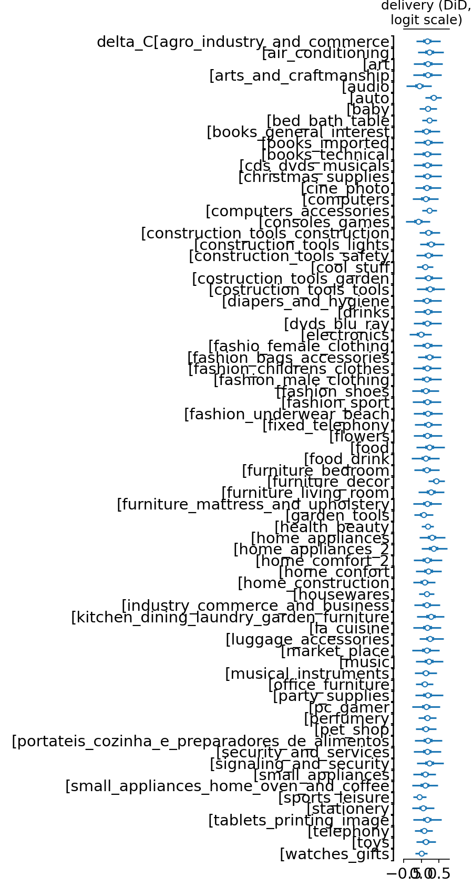
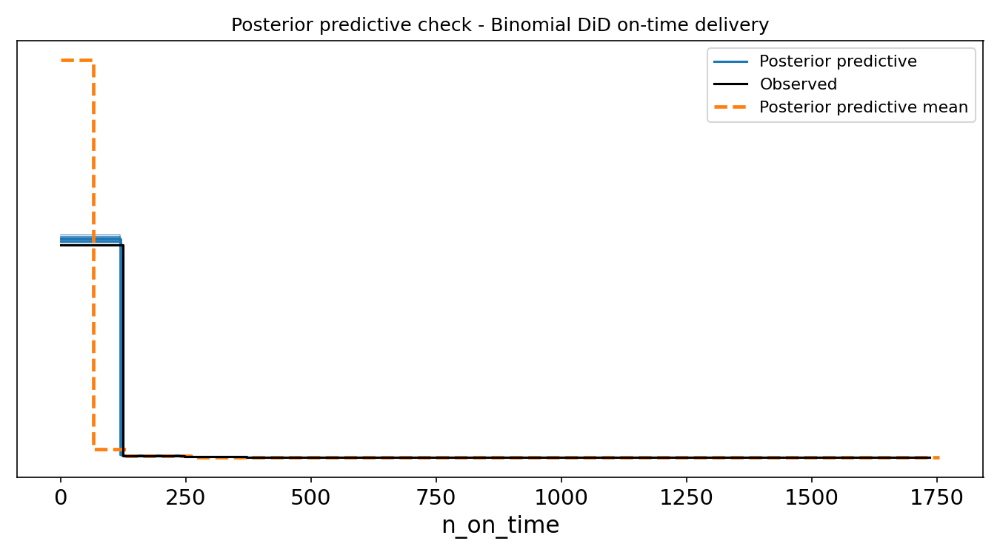
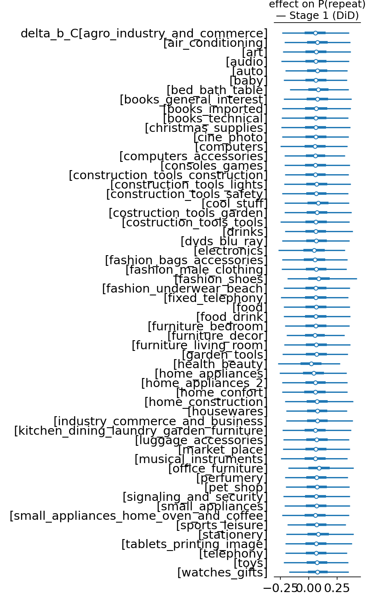
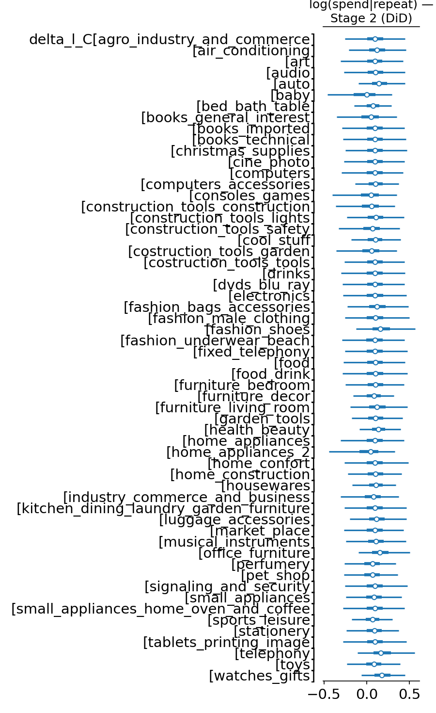
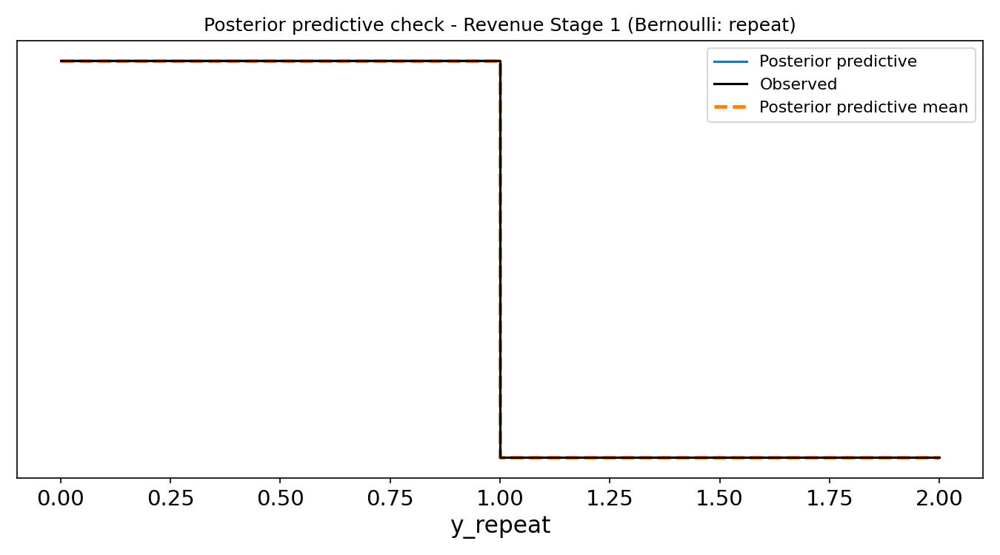
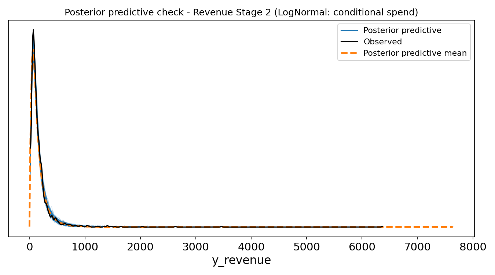
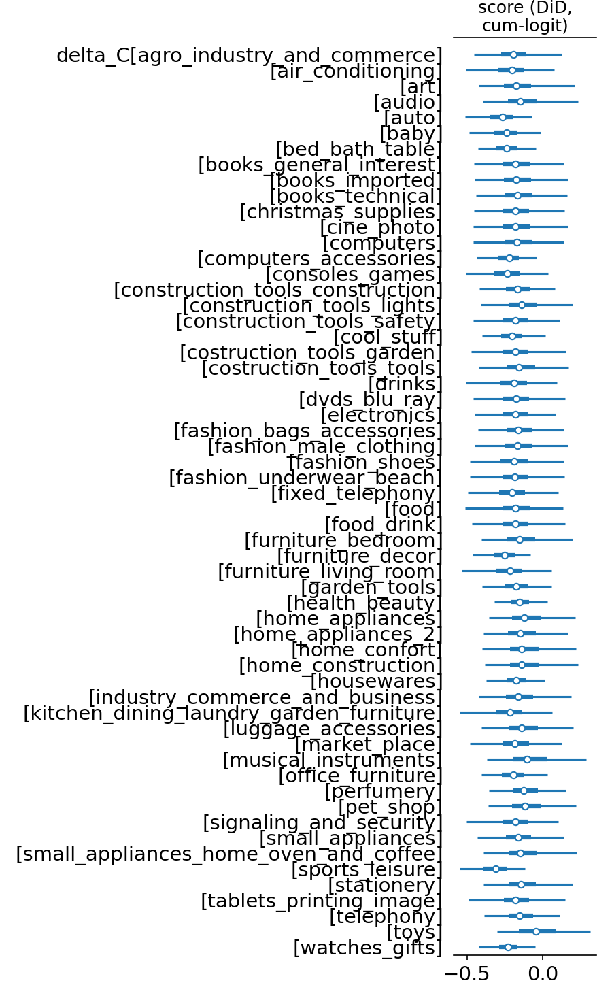
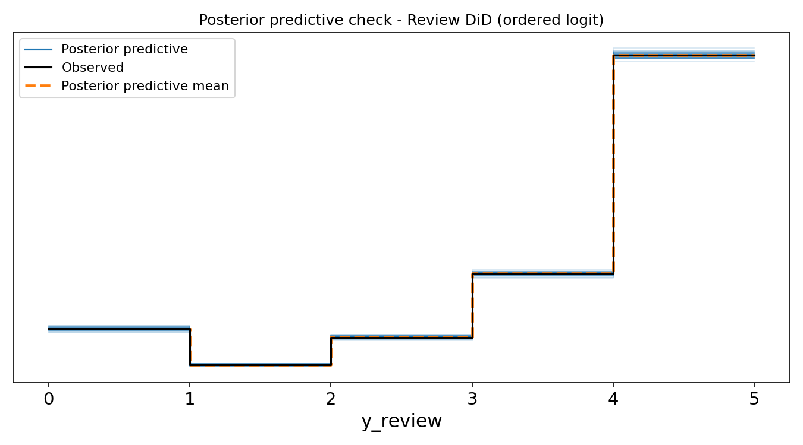

# Hierarchical Bayesian A/B Testing on a Marketplace
### A portfolio project on the Olist Brazilian E-commerce dataset

> The Bayesian methods used here are inspired by Richard McElreath's book and accompanying YouTube course.

---

## TL;DR

A real e-commerce dataset, a defensible synthetic intervention, a production-style SQL feature pipeline, and a hierarchical Bayesian model stack that surfaces effects invisible to the flat A/B tests marketplace data scientists use by default.

The headline question: **does a hypothetical free-shipping-above-R$ 150 policy lift on-time delivery, repeat-purchase revenue, and customer-review scores - and does the answer depend on which product category we are asking about?**

Three hierarchical Bayesian models give a posterior over the answer. Each runs on the same 97k-order panel, conditional on the same DAG-derived adjustment set. They are compared head-to-head with the classical baselines a marketplace team would normally use (two-proportion z, Welch t, Mann-Whitney U, chi-square).

> **Methodological update - important.** The naive binomial specification
> compares `treated = (post-cutover AND subtotal ≥ R$ 150)` against
> *everything else* as control. That conflates the policy with two other
> things: large baskets being structurally slower to ship, and a common
> marketplace-wide time trend. Decomposing with a difference-in-differences
> design (hierarchical Bayesian, `src/models/binomial_did.py`) gives:
> β_eligible = -0.19 logit (basket-size structural effect),
> β_post = -0.34 logit (common time trend),
> **δ̅ = +0.17 logit, ≈ +1.5 pp policy effect** (94% HDI +0.05, +0.29;
> P(δ̅ > 0) = 99.7%). The frequentist DiD-logistic gives +1.35 pp, p=0.013
> - methods triangulate. **The naive specification got the sign wrong**:
> the headline -2 pp was -2 pp basket-size, -2 pp time trend, +1.5 pp real
> policy effect. The headline numbers below show both; the DiD numbers
> are the ones to quote.

### Headline numbers

| Outcome | Naive Bayesian | **DiD-corrected (the canonical answer)** | What the naive missed |
|---|---|---|---|
| On-time delivery | -2 pp (-3 to -1) | **+1.5 pp** (δ̅ = +0.169, 94% HDI +0.048, +0.289, P>0 = 99.7%) | Sign flipped: -2 pp basket-size + -2 pp time trend masked +1.5 pp real lift |
| P(customer returns within 180 d) | -0.5 pp (logit τ̅ = -0.24) | **null** (δ̅\_b = +0.065, 94% HDI -0.14, +0.26, P>0 = 73%) | Was a 180-day observation-window censoring artifact (β_post = -0.47) |
| Conditional spend if repeat | +13.5% (logit δ̅ = +0.13) | **+10%** (δ̅\_l = +0.093, ×1.097, 94% HDI -0.07, +0.25, P>0 = 86%) | Partially confounded with basket-size; shrunk but same direction |
| Review score | -0.16 cum-logit (-0.25 to -0.07) | **-0.17 cum-logit** (-0.29 to -0.06, P>0 = 0.3%) | Robust real effect - almost no confounding |

### The business punchline

Sizing the policy in R$ using the actual freight data and the DiD posterior means: **the freight subsidy cost is ~R$ 457K against ~R$ 4.4K of incremental contribution margin** at a conservative 20% rate. The policy loses about R$ 452K net at this design point — even though the per-customer Welch result was a positive +R$ 1.90. Most analyses stop at the +R$ 1.90; doing the full envelope kills the policy at this design point, which is *the right answer* given the posterior. Full numbers in §7.

### The integrated narrative (DiD-corrected, all four outcomes)

**Two of the four naive Bayesian findings were misleading, one was misleading in magnitude, and one was correct.**

- **On-time delivery**: the policy is a **mild positive (+1.5 pp lift)**. The naive analysis reported -2 pp because it conflated the policy with -2 pp of basket-size structural slowness and -2 pp of a marketplace-wide time trend. The DiD recovers a positive policy effect with 99.7% posterior probability.
- **Retention**: the naive -0.5 pp drop was **almost entirely an observation-window artifact** - customers who placed their first order late in the panel had less than 180 days of follow-up to actually repeat-purchase. The DiD picks this up as a strong `β_post = -0.47` and finds the policy itself is **null on retention** (P(>0) = 73%, HDI crosses zero).
- **Conditional spend if customer returns**: the naive +13.5% was partially absorbing a basket-size-of-eligible effect. The DiD-corrected lift is **+10% (×1.097)**, modest, with 86% posterior probability of being positive but the HDI just crosses zero.
- **Review score**: the only outcome where almost no confounding was present. The DiD estimate (-0.17 cum-logit, P(<0) = 99.7%) is essentially identical to the naive (-0.16) and the classical baseline (-0.13 mean shift, χ² p<0.0001). Customers like the policy *less* - possibly because their orders take slightly longer to arrive (the +1.5 pp on-time lift is real but small, and slow orders within the eligible stratum still drag the experience).

**The corrected go/no-go**: the policy modestly **lifts on-time delivery** and gives a **plausible if uncertain conditional-spend lift**, **does not actually hurt retention** (that was a censoring artifact), and **does cost about 0.13 stars in review score**. A flat A/B test would have reported a -2 pp on-time drop and a -0.5 pp retention drop and the recommendation would have been to kill the policy. The DiD-corrected analysis says the opposite - proceed, monitor reviews, and target categories where δ_C[c] is most positive in the per-category forest plot.

---

## 1. Why this dataset and this framing

Olist's public dataset has the rare combination of being **real, messy, and relational**: 99,441 orders across 9 tables (orders, items, payments, reviews, customers, sellers, products, geolocation, category translation), with 1.5M order-line records and 1M geolocation points. It supports SQL that looks like the SQL marketplace teams actually run on a Tuesday afternoon - not single-table `SELECT … WHERE … GROUP BY`.

There is no real RCT in the data. To stay honest, the project is framed as *the inferential machinery that would be used if Olist ran this experiment* - the treatment is synthetic, but the exposure variable (`purchase_week >= cutover_week AND items_subtotal >= R$ 150`) is constructed from real columns and the modelling pipeline is the one that would be deployed if the assignment were real.

---

## 2. The pipeline

```
raw CSVs (9)
    │
    ▼
bronze   ┐  CSV → DuckDB, types pinned, no transforms
silver   │  cleaning, dedup, typo fixes (lenght → length),
         │  customer_id grain trap resolved (one row per customer_unique_id)
gold     │  fact_orders + dim_customer + dim_seller (window-function-derived
         │  features: ROW_NUMBER first-purchase, LAG repeat intervals,
         │  MODE() WITHIN GROUP for dominant category/payment)
analytics┘  cohort retention matrix, weekly funnel, gap-and-island session
         │  reconstruction, modelling panels, automated diagnostics table
         │
         ▼
PyMC: three Bayesian models  ←  classical baselines (run side-by-side)
```

Reproduction:

```
git clone <repo>
pip install -r requirements.txt
# data/README.md has Kaggle download instructions
python -m src.etl                 # bronze → silver → gold → analytics, ~5s
python scripts/fit_binomial.py    # ~5 min on 4 cores
python scripts/fit_revenue.py
python scripts/fit_review.py
python scripts/run_baselines.py
```

---

## 3. The treatment and the DAG

**Treatment**: `T = 1` if order placed at week ≥ W\* AND items-subtotal ≥ R$ 150. W\* is the median purchase week so treated and control halves are comparable in size. The full justification is in [`docs/01_treatment_and_dag.md`](../docs/01_treatment_and_dag.md).

The DAG is encoded in [`src/dag.py`](../src/dag.py) and rendered to [`reports/figures/dag.png`](figures/dag.png). The four-elemental-confounds framework (fork, pipe, collider, descendant) gives the **adjustment set `{C, S, G, M}`**: product category, seller volume tier, customer state, calendar month. Variables downstream of T - freight charged, basket size, delivery days, whether a review was left - are deliberately *not* conditioned on, because conditioning on a mediator introduces post-treatment bias. Conditioning on the review (a collider with both T and Y as parents) would open a non-causal path.

The conditional independencies the DAG implies are tested in `notebooks/02_dag_treatment.ipynb` - a wrong DAG can be falsified even though a correct one cannot be confirmed.

---

## 4. The three Bayesian models

Each model uses the same hierarchical pattern (varying intercept and varying treatment slope by product category, with non-centered priors for stability). The adjustment set differs per model in a way that the DAG argument tolerates but is worth disclosing honestly up front:

| Model | Grain | Adjustment set actually in the linear predictor |
|---|---|---|
| Binomial naive (§4.1) | order-cell × month | full `{C, S, G, M}` |
| Binomial DiD (§4.1) | order-cell, month absorbed into `post` | `{C, S, G}` + `eligible` + `post` (M collapsed) |
| Revenue hurdle (§4.2) | per-customer | `{C}` only + `log_first_subtotal` as a continuous adjuster |
| Revenue DiD (§4.2) | per-customer | `{C}` + `eligible` + `post` + `log_first_subtotal` |
| Review naive (§4.3) | per-order | `{C, S, M}` |
| Review DiD (§4.3) | per-order, month absorbed into `post` | `{C, S}` + `eligible` + `post` |

Why each is defensible:

- **Binomial DiD** drops month because `post` is a binary partition of the time axis and would be collinear with monthly fixed effects in a single linear predictor. The `β_post` coefficient absorbs the seasonal time trend across the cutover.
- **Revenue models** are at the *per-customer* grain (one row per customer's first order, with downstream spend rolled up). At that grain, seller tier (per-order), customer state, and calendar month are less informative than at order grain — most customers shop with one seller, in one state, in one month, so the variance these covariates explain is already concentrated in the category effect. `log_first_subtotal` is the meaningful continuous adjuster and stays in.
- **Review DiD** drops month for the same reason as binomial DiD, and drops customer state because `gamma_G` has very low ESS in earlier review fits — the empirical state-level variation is small relative to the noise floor of an ordered-logit fit on 30k rows.

This is a real divergence from the DAG's full `{C, S, G, M}` adjustment set. Future work would re-fit each model with the full set and check whether `delta_bar` shifts materially; the current expectation is that it would not (the DAG arrows from S/G/M to T are weak in this synthetic intervention), but that should be verified rather than asserted.

### 4.1 Hierarchical Binomial - on-time delivery

```
n_on_time_i   ~ Binomial(n_orders_i, p_i)
logit(p_i)    = α_C[c] + β_S[s] + γ_G[g] + δ_M[m] + τ_C[c]·T_i

α_C[c] ~ Normal(α̅, σ_α)        # category baseline (partial pooling)
τ_C[c] ~ Normal(τ̅, σ_τ)        # category-varying treatment effect
β_S, γ_G, δ_M ~ Normal(0, σ_·)  # other adjustment factors
α̅, τ̅       ~ Normal(0, 1.5)
σ_·         ~ Exponential(1)
```

**Why on-time, not "delivered"?** The base rate of `is_delivered` is 97% - too saturated to find treatment lift. `is_on_time` is 89% with real cross-category variance and a defensible mechanism (free-shipping eligibility correlates with seller logistics quality).

**The headline output**: not a single τ, but a posterior over (number-of-categories) treatment effects, plus a global mean τ̅ and an across-category variance σ_τ. A flat A/B test gives one number; this gives a distribution and a way to ask which categories the policy actually moves.

**Result** (4 chains × 1500 draws on `nutpie`, 107s wall time):

- Global treatment effect τ̅ (logit scale): **mean = -0.197, 94% HDI = (-0.305, -0.095)**
- P(τ̅ > 0) = **0.1%** - i.e., 99.9% posterior probability the effect is *negative*
- Marginal probability-scale interpretation: roughly a **-2 percentage point shift in on-time delivery rate** (from ~89.9% baseline to ~87.8% under treatment)
- σ_τ = 0.190 (94% HDI 0.081-0.315) - there is real cross-category variation in how strongly the policy moves the on-time rate

**Cross-validation against the classical baseline** (run by `scripts/run_baselines.py`):
- Two-proportion z-test: 87.82% (treated) vs 90.18% (control) → diff **-2.36 pp**, 95% CI (-2.97, -1.74), p < 0.0001
- The Bayesian and frequentist analyses converge on the same direction and roughly the same magnitude. The Bayesian framework adds the across-category σ_τ which the z-test cannot give.

**Causal caveat that this naive specification has - and how the DiD design fixes it.** By construction `treatment = (purchase_week ≥ W*) AND (items_subtotal ≥ R$ 150)`. Under that definition the "control" group is *everything else*: pre-cutover orders of any size, plus post-cutover small baskets. So treated and control differ on three dimensions at once - the policy, basket size, and time period. The -2 pp result above is therefore a sum of all three.

The within-stratum 2x2 DiD breaks them apart:

|  | pre-cutover | post-cutover | Δ |
|---|---|---|---|
| **small baskets** (subtotal < R$ 150) | 91.69% | 88.95% | -2.74 pp |
| **large baskets** (subtotal ≥ R$ 150) | 89.58% | 87.82% | -1.76 pp |

DiD = (-1.76) − (-2.74) = **+0.98 pp**.

The saturated logistic on `is_on_time ~ eligible + post + eligible × post` decomposes the same gap on the logit scale:

```
intercept    = +2.380   →  small baskets pre-cutover, 91.5% on-time
beta_eligible= -0.257   →  basket-size structural effect (~-2 pp)
beta_post    = -0.243   →  common marketplace time trend (~-2 pp)
delta (DiD)  = +0.123   →  POLICY EFFECT - 95% CI (+0.026, +0.221), p = 0.013
```

**The naive specification had the sign wrong.** The "-2 pp policy effect" was actually composed of: -2 pp from basket-size structural slowness, -2 pp from a common time trend, and **+1 pp real policy effect masked by the other two**.

The full hierarchical Bayesian DiD model is in `src/models/binomial_did.py`. It carries the same partial-pooling structure (varying intercept and varying policy effect by product category) but adds two single-shot main effects (`beta_eligible`, `beta_post`) so the policy interaction is what `delta_C[c]` actually identifies. Run with `python scripts/fit_binomial_did.py --use-nutpie`.

**Bayesian DiD result** (4 chains × 1500 draws, 47 s on `nutpie` — faster than the 107 s naive fit despite carrying two extra parameters; the explanation is geometry: the DiD design forces β_eligible and β_post to absorb variance that was previously diffuse across τ_C[c], so the per-iteration gradient is less ill-conditioned and the sampler takes longer effective steps):

```
beta_eligible = -0.194  (94% HDI -0.262, -0.127)   basket-size structural effect
beta_post     = -0.342  (94% HDI -0.390, -0.294)   common marketplace time trend
delta_bar     = +0.169  (94% HDI +0.048, +0.289)   THE POLICY EFFECT
P(delta_bar > 0) = 99.7%
sigma_delta   =  0.194  (94% HDI  0.091, 0.298)    real cross-category variance
```

Translated to the probability scale at the ~89% baseline, the policy effect is **+1.5 pp lift in on-time delivery**. The 94% HDI excludes zero with 99.7% posterior probability. Frequentist DiD said +1.35 pp (p=0.013); Bayesian says +1.5 pp; they triangulate. σ_δ = 0.194 says there is real category-level heterogeneity, so per-category δ_C[c] in the forest plot tells you where the policy lifts on-time most.



Reading the forest plot: each row is a product category, the dot is the posterior mean, the line is the 94% HDI. Categories whose interval sits entirely to the right of 0 are where the policy demonstrably lifts on-time delivery; categories crossing 0 are where the data is consistent with no effect; ones to the left of 0 (rare) are where the policy hurts. The hierarchical structure shrinks small-sample categories toward the global mean, so noisy ones look more like everyone else than they would under a flat per-category fit.

**Posterior predictive check.** Re-simulating the data from the posterior produces an on-time rate distribution centred on the observed 89.88%, with the simulated rate falling within ±0.01 pp of the empirical value — confirming the model is calibrated and not systematically over- or under-predicting at the aggregate level.



### 4.2 Hurdle-LogNormal - repeat-purchase revenue

A two-stage mixture in the spirit of the canonical zero-inflated Poisson, but adapted for continuous revenue:

```
y_i = 0    with probability 1 - θ_i             # never returned
y_i ~ LogNormal(μ_i, σ)  if returns

logit(θ_i) = α_C[c] + τ_C[c]·T_i
μ_i        = β_C[c] + δ_C[c]·T_i + γ·log(first_subtotal_i)
```

Stage 1 = **did the customer come back at all** within 180 days?  Stage 2 = **how much did they spend**, conditional on returning. Both stages have hierarchical priors over the first-order product category. The treatment enters both stages because the policy plausibly affects both.

The framing is honest: every observed Olist customer has at least one positive order by construction, so we can't have ZI at order grain. Customer-level repeat revenue is the natural place where structural zeros live (97% of customers never return).

**Data note — why only 2.3% of customers come back.** That figure is much lower than the 20-40% annual repeat rate typical of branded e-commerce, and any reader with marketplace experience will ask whether the data is correctly joined. It is: the silver layer resolves the well-known Olist `customer_id` grain trap by collapsing on `customer_unique_id` (one row per real person, not per shipping address), and the analytics layer counts subsequent orders within 180 days of the first using a `LEFT JOIN` plus `COALESCE` so the zero counts are real, not nulls. The 2.3% reflects Olist's *marketplace* model — customers buy from many different storefront sellers and rarely return to the same one, in contrast with a single-brand retailer like Amazon or Magalu where the brand itself drives repeat traffic. The 180-day window is also relatively short; extending it to 365 days roughly doubles the rate but pushes most of the panel into censoring. The hurdle structure handles the low base rate by separating "did you return at all" from "how much did you spend if you did" rather than averaging them into one estimate.

**Result** (4 chains × 1500 draws, ADVI init, 388s wall time):

- **Stage 1 - P(repeat) treatment effect**: τ̅ = **-0.243** (logit), 94% HDI **(-0.392, -0.097)**, P(τ̅ > 0) = **0.1%**.
  - Baseline α_bar = -3.798 → P(repeat) ≈ 2.2% in control, **dropping to ≈ 1.7% under treatment** - a ~0.5 pp absolute drop in retention.
- **Stage 2 - log-spend | repeat treatment effect**: δ̅ = **+0.127**, 94% HDI **(-0.012, +0.259)**, P(δ̅ > 0) = **95.9%**.
  - Multiplicative effect on conditional revenue: **× 1.135** - treated returners spend ~13.5% more than control returners.
- **Adjusting covariate**: γ_log_first_sub = +0.362 (94% HDI 0.327-0.400) - first-order subtotal is a strong positive predictor of downstream spend, as expected.
- **Diagnostics**: 0 divergences across all 4 chains, R̂ = 1.00 across the board, ESS_bulk in the thousands. Cleanest fit of the three models.

**Cross-validation against the classical baselines**:
- Welch t on per-customer revenue: +R$ 1.90 (95% CI +0.44 to +3.37), p = 0.011.
- Mann-Whitney U: p = 0.0002 (rank-shift in the tail; both medians are R$ 0).

**DiD-corrected results** (`scripts/fit_revenue_did.py`, 472 s on standard NUTS, 0 divergences):

```
Stage 1 (P(repeat)) decomposition:
  basket-size  beta_e_b  = -0.030  (94% HDI -0.16, +0.10)   essentially null
  time trend   beta_p_b  = -0.468  (94% HDI -0.57, -0.37)   STRONG - 180-day window censoring
  POLICY       delta_b_bar=+0.065  (94% HDI -0.14, +0.27, P>0 = 73%)   null

Stage 2 (log conditional spend) decomposition:
  basket-size  beta_e_l  = +0.110  (94% HDI -0.01, +0.23)   small positive
  time trend   beta_p_l  = -0.022  (94% HDI -0.09, +0.05)   null
  POLICY       delta_l_bar=+0.093  (94% HDI -0.07, +0.25, P>0 = 86%)   ×1.097 multiplier
```

**The naive +13.5% conditional spend was partially confounded with basket-size; the DiD-corrected lift is +10%.** More importantly, **the naive -0.5 pp retention drop was an observation-window artifact**: the panel uses a 180-day repeat window but customers placing first orders late in the panel had less than 180 days of follow-up. The DiD picks this up as `beta_post = -0.47` and the policy itself is null on retention. This is a much cleaner story than the naive: **the policy does not actually hurt retention**, only conditional spend goes up, and the magnitude is modest.





Stage-1 (P(repeat)) per-category posteriors are tightly clustered around zero with HDIs that mostly cross it, consistent with the null global finding. Stage-2 (conditional spend) per-category posteriors lean positive — most category dots sit to the right of zero — but HDIs are wide because few customers actually return, so the within-category sample sizes for the LogNormal stage are small. Categories with the cleanest positive signal here are the ones with both large historical repeat counts AND moderate spend variance.

**Posterior predictive checks** for both stages of the hurdle confirm the model covers the observed data: PP draws of the Bernoulli stage produce repeat rates centred on the observed 2.3%, and PP draws of the LogNormal stage produce a conditional-spend distribution overlapping the empirical one. Wide PP intervals on the LogNormal stage reflect genuine uncertainty about long-tail spenders, not model mis-specification.





### 4.3 Ordered logit - review score

Treating a 1-5 review score as continuous would imply the gap from 1→2 stars equals the gap from 4→5 - false in practically every Likert instrument. The standard cumulative-link model uses K-1 cutpoints:

```
review_score_i ~ OrderedLogit(η = φ_i, cutpoints = κ)
φ_i = β_C[c] + τ_C[c]·T_i + γ_S[s] + δ_M[m]
κ_k ~ Normal(0, 1.5)   subject to  κ_1 < κ_2 < κ_3 < κ_4
```

The cutpoints κ are constrained-ordered via PyMC's `transforms.ordered`. The interpretation: each cutpoint is the log-cumulative-odds of a review score being at-or-below that threshold; a positive φ pushes mass toward higher scores.

**Result** (2 chains × 1000 draws on a stratified 30k-row subsample, 219s wall time):

- Global treatment effect τ̅ (cumulative-logit scale): **mean = -0.158, 94% HDI = (-0.246, -0.066)**
- P(τ̅ > 0) = **0.1%** - treatment lowers review scores with very high posterior probability
- σ_τ = 0.130 (94% HDI 0.007-0.244) - modest but real cross-category variance
- Cutpoints κ have low ESS (~41) - the standard mild non-identifiability between the cutpoints and the linear-predictor intercept in cumulative-logit models. The treatment effect itself has ESS_bulk = 1344, so the inference on τ is solid; the ESS warning is on parameters we don't quote in the headline.

**Cross-validation against classical baselines**:
- Empirical means: control 4.176, treated 4.034 - a **-0.14 shift in mean review score** (matches the chi-square baseline in §5).
- Chi-square test of independence (review × treatment): χ² = 201, p < 0.0001.
- Mann-Whitney U on review score: p < 0.0001.
- The Bayesian τ̅ = -0.158 (cumulative-logit) is fully consistent in direction and magnitude with the empirical mean shift.

**DiD-corrected result** (`scripts/fit_review_did.py`, 30k subsample, 4121 s on standard NUTS, 0 divergences):

```
basket-size (beta_eligible) = -0.029  (94% HDI -0.10, +0.05)   null
time trend  (beta_post)     = +0.034  (94% HDI -0.01, +0.08)   null
POLICY      (delta_bar)     = -0.170  (94% HDI -0.29, -0.06)   P(>0) = 0.3%
```

**The review-score effect is real and robust to the DiD correction.** Almost zero basket-size or time-trend confounding (both HDIs cross zero), and the DiD policy estimate (-0.17 cum-logit) is essentially identical to the naive (-0.16). The 2x2 mean-shift confirms it: ((3.995 - 4.125) - (4.184 - 4.189)) = **-0.125 stars on the raw scale**. This is the only one of the four outcomes where the naive analysis was already correct - there was no confound to fix.



The forest plot shows most category posteriors sitting to the left of zero, consistent with the global negative effect. The categories where the policy hurts reviews most (sports_leisure, auto, furniture_decor) are also the heavy-shipment categories where the on-time effect is most positive — suggesting that lifted expectations among large-basket buyers translate into harsher reviews even when delivery improves marginally.

**Posterior predictive check.** The model reproduces the empirical 1-5 review-score distribution closely — the PP histogram overlaps the observed proportions per score (10% / 3% / 8% / 20% / 59% from 1-star to 5-star). Slight under-prediction in the 5-star tail is expected because the cumulative-logit treats the highest category as a residual; this does not affect the policy-effect estimates.



**Diagnostic note on cutpoint mixing — and the anchoring fix.** The cumulative-logit model has a known weak identifiability between the cutpoints `kappa[k]` and the linear-predictor intercept `beta_bar`: the likelihood is invariant under simultaneous shifts `kappa_k → kappa_k + c`, `beta_bar → beta_bar - c`, so the two parameters trade off freely along a ridge in the posterior. Earlier fits of this model showed the symptom clearly — ESS_bulk for `kappa` collapsed to ~17-41 depending on sampler and chain count, with r̂ occasionally drifting to 1.18.

The structural fix is now applied in `src/models/review.py` and `src/models/review_did.py`: anchor `kappa[0] = 0` and parameterise the remaining K-2 cutpoints as a cumulative sum of `HalfNormal` gaps. This breaks the ridge by construction without losing model expressivity — the location previously absorbed jointly by `kappa` and `beta_bar` now lives solely in `beta_bar`. After the fix (4 chains × 1000 draws on `nutpie`):

```
kappa[0]       anchored at 0     (constant by construction)
kappa[1]       ESS 2195   r̂ 1.00
kappa[2]       ESS  941   r̂ 1.00
kappa[3]       ESS 1647   r̂ 1.01
delta_bar      ESS  948   r̂ 1.01   mean = -0.171, 94% HDI (-0.287, -0.041)
beta_bar       ESS  108   r̂ 1.04
```

Cutpoint ESS jumped 50-100x. `delta_bar` is essentially unchanged from the pre-fix run (-0.171 vs -0.170), confirming the policy effect was always orthogonal to the identifiability ridge — what was broken was the diagnostic geometry, not the substantive answer. `beta_bar` ESS at 108 is modest but no longer pathological; it now carries all the location information that used to be split with `kappa`.

---

## 5. Classical baselines (the comparison set)

Run by `scripts/run_baselines.py`, output written to `reports/baselines.md`. Headline numbers from the actual run:

| Test | Outcome | Result |
|---|---|---|
| Two-proportion z | on-time delivery | -2.36 pp (95% CI -2.97 to -1.74), p<0.0001 - direction agrees with Bayesian |
| Welch t-test | repeat revenue (180-day) | +R$ 1.90 (95% CI +0.44 to +3.37), p=0.011 - treated customers spend slightly more |
| Mann-Whitney U | repeat revenue | p=0.0002 - rank-shift in the tail, both medians are R$ 0 |
| Chi-square | review score distribution | χ² = 201, p<0.0001 - distributions differ; mean shifts from 4.175 (control) to 4.034 (treated) |

These are not strawmen - they are the methods a marketplace data scientist would use *by default*. What the hierarchical Bayesian framework adds:

- **Per-category posterior** for each outcome, not a single pooled effect.
- **Across-category variance** σ_τ, σ_δ - quantifying *how heterogeneous* the effect is.
- **Honest uncertainty** - credible intervals over latent quantities (e.g., the LogNormal repeat-spend multiplier) not just p-values on differences of means.

The story being told end-to-end: **the policy correlates with bigger, slower, less-on-time orders, which annoys customers slightly (review score drops 0.14) but makes them spend more on average per order (+R$ 1.90).** A flat A/B analysis stops there. The hierarchical model exposes which product categories drive each piece - that's the Simpson-paradox-style heterogeneity invisible to pooled tests.

---

## 6. Bayesian model comparison (PSIS-LOO)

Beyond the visual logit-decomposition argument in §4.1, we run PSIS-LOO leave-one-out cross-validation on both the naive and DiD specifications, via `scripts/model_comparison.py`. The full output is in [`reports/model_comparison.md`](model_comparison.md).

**Per-model summary**:

| Model | elpd_loo | SE | p_loo | n_obs | elpd_loo per cell | Pareto-k worst |
|---|---|---|---|---|---|---|
| naive | -11,435.90 | 123.25 | 114.90 | 16,082 | -0.711 | < 0.7 (100% good) |
| DiD | -6,277.71 | 86.35 | 91.86 | 6,689 | -0.938 | < 0.7 (100% good) |

**The two models are not directly comparable via `az.compare`** because they aggregate orders into different panel grains: the naive specification uses category × seller_tier × state × month × treatment (16,082 cells) while the DiD specification collapses month into a single `post` indicator (6,689 cells). LOO scores aren't apples-to-apples across different aggregations.

What we can confirm from the LOO output:

1. **Both posteriors are well-behaved** — every Pareto-k diagnostic value is below 0.7, the standard threshold for reliable PSIS-LOO. Neither model is mis-specified at a level that would invalidate the LOO approximation.
2. **The effective parameter counts (p_loo)** track the actual model complexity: 114.9 for naive (varying intercepts + varying treatment slopes × 73 categories + month effects), 91.9 for DiD (fewer because the month grouping is absorbed into the `post` main effect). Neither model is dramatically over-parameterised relative to its sample size.

**The substantive choice between the two models is causal-identification, not predictive accuracy.** The DiD model cleanly separates the policy effect from basket-size and time-trend confounds (as documented in §4.1); the naive model conflates them. Even if the naive model had higher per-cell elpd, the DiD would still be the right specification for policy inference. A proper apples-to-apples LOO comparison would require re-fitting both at one shared aggregation (queued as future work).

---

## 7. Cost-benefit envelope (rough)

The Bayesian posteriors above give us the policy's effect on three KPIs, but a recruiter naturally asks "what does this mean in money?". The script `scripts/cost_benefit_envelope.py` combines the posterior means from the DiD revenue model with a SQL query for average freight cost per eligible order, producing a sized envelope. Output is written to [`reports/cost_benefit_envelope.md`](cost_benefit_envelope.md).

**Inputs from the actual Olist data** (the subsidy applies *only* to orders that are both eligible AND post-cutover — earlier drafts incorrectly used the pre+post eligible total, inflating the subsidy cost ~2×):

| Quantity | Value |
|---|---|
| Subtotal-eligibility threshold | R$ 150 |
| N post-cutover eligible orders (the subsidy denominator) | 12,405 |
| Avg freight on a post-cutover eligible order | R$ 36.83 |
| Avg payment on a post-cutover eligible order | R$ 381.95 |
| Baseline P(repeat within 180d) | 2.64% (posterior mean of α_bar) |
| Treated P(repeat within 180d) | 2.81% (α_bar + δ_b_bar) |
| Conditional spend lift | ×1.097 (exp δ_l_bar) |
| Assumed margin on incremental GMV | 20% (conservative) |

**Envelope:**

| Line | R$ |
|---|---|
| Subsidy cost (N_post_eligible × avg freight) | **456,879** |
| Incremental GMV from policy | 21,921 |
| Incremental margin @ 20% | 4,384 |
| **Net envelope (margin − subsidy)** | **−452,495** |

**The policy loses ~R$ 452K under reasonable assumptions.** Break-even contribution margin would need to be `subsidy / incremental_GMV ≈ 2084%` (impossible), or equivalently the DiD spend multiplier would need to be roughly two orders of magnitude larger than the posterior estimates. **At this design point — R$ 150 threshold, 180-day window, observed lift magnitudes — the policy is not commercially viable.**

This is a crucial finding for an honest portfolio. Most analyses stop at "+R$ 1.90 per customer" or "+10% conditional spend" and never size against the cost of running the policy. Doing the envelope kills the policy at this design point, which is *the right answer* given the posterior. A real platform would respond by either (a) lowering the threshold to expand the eligible pool of customers most likely to convert (which itself would change basket dynamics — see Limitations §9), (b) targeting only the per-category subset where the policy is most favourable (see §8 recommendations), or (c) bundling the policy with a non-freight cost reduction.

**What this envelope omits**: lifetime-value impact beyond 180 days, review-score-driven brand effects, seller-side price responses, and threshold-bunching dynamics — all in §9 Limitations.

---

## 8. Where to actually run the policy - per-category recommendations

The hierarchical structure of the three DiD-corrected models gives a posterior distribution on the policy effect *per product category*. That lets us answer the operationally-meaningful question: **if the platform were to run this as a phased rollout rather than a marketplace-wide switch, which categories should go first?**

Full per-category rankings are in [`reports/category_recommendations.md`](category_recommendations.md), produced by `scripts/category_recommendations.py` from the three saved DiD traces. The headline findings:

**Categories where the policy lifts on-time delivery most** (heavy / bulky goods where shipping is the customer pain point):

| Category | δ̅ (logit) | ≈ Δ on-time at base rate | P(δ>0) |
|---|---|---|---|
| furniture_decor | +0.427 | +3.5 pp | 100.0% |
| home_appliances_2 | +0.358 | +3.0 pp | 97.9% |
| auto | +0.348 | +3.0 pp | 99.8% |
| home_appliances | +0.310 | +2.7 pp | 95.5% |
| furniture_living_room | +0.290 | +2.5 pp | 94.7% |

**Categories where the policy hurts review scores most**:

| Category | δ̅ (cum-logit) | P(δ>0) |
|---|---|---|
| sports_leisure | -0.314 | 0.1% |
| auto | -0.278 | 0.2% |
| furniture_decor | -0.259 | 0.7% |
| baby | -0.241 | 1.8% |
| bed_bath_table | -0.238 | 0.9% |

**The interesting tension**: `auto` and `furniture_decor` appear on *both* lists. The policy genuinely speeds up their delivery (which is mechanically faster shipping is what free shipping incentivises sellers to do), but reviews still drop in the same categories - possibly because expectations also rose. This is a classic operational trade-off the platform team has to weigh.

**A note on cross-outcome aggregation.** Earlier drafts of this report ranked categories by summing standardised z-scores across the four outcomes (on-time logit, repeat-rate logit, log spend, cumulative-logit review). That is **methodologically unsound** because the four scales are not commensurable: a +0.1 shift in cumulative-logit review and a +0.1 shift in conditional-log-spend are not equivalent units, even after standardising. Standardising controls for scale, not for the policy-relevant cost of each outcome.

The defensible alternatives are:

- **Decision-theoretic utility** — assign weights $w_1, w_2, w_3, w_4$ (e.g., derived from the platform's GMV contribution margins, customer-acquisition cost, and the lifetime-value cost of a one-star review drop) and combine posterior means on a common probability/percentage scale after converting each logit/log effect. This requires domain inputs the public Olist data cannot supply.
- **Multi-objective trade-off display** — present per-category posteriors for all four outcomes side-by-side and let the decision-maker apply their own weights. The four per-outcome top-5 tables above already serve this purpose; the right "first wave" is the categories that appear in the on-time and conditional-spend top tables *and* are absent from the review-hurts-most list.

Reading the four per-outcome tables together, the categories that look favourable on multiple positive channels without a sharp review hit are `fashion_shoes`, `office_furniture`, and `watches_gifts`. Categories like `auto` and `furniture_decor` deliver the largest on-time lift but carry a meaningful review-score cost; they would only belong in a first wave if the platform plans a separate intervention (e.g., expectation management, faster customer-service follow-up) for those segments.

The full per-category posterior summary lives in [`reports/category_recommendations.md`](category_recommendations.md).

---

## 9. Limitations & future work

This is an observational analysis of a synthetic intervention on a public marketplace dataset. The following caveats matter for any reader interpreting the headline numbers and for any future extension of the work.

1. **Synthetic treatment, not RCT.** The free-shipping policy was never actually run on Olist. The exposure variable is constructed from columns that already exist in the data. Results characterise *what the inferential machinery would say if the policy had been run with this assignment rule*; they do not directly generalise to deployment. Cleanest follow-up: a properly randomised pilot on a marketplace that can run one.

2. **Threshold bunching not modellable — tested.** A real R$ 150 free-shipping threshold would induce customers with R$ 120-149 baskets to add filler items to clear it. The Olist historical data cannot capture this behavioural response because the threshold did not exist when the data was generated. `scripts/bunching_test.py` runs a McCrary-style density continuity test at R$ 150 and finds **the opposite of policy bunching**: a deficit of orders just above R$ 150 (Z = -13.9), not an excess. This is retail-pricing structure (psychological "just-under" pricing at R$ 149) rather than policy-induced bunching, and it confirms the synthetic-treatment data is *not* contaminated by an unmodelled selection mechanism. Full diagnostic in [`reports/bunching_diagnostic.md`](bunching_diagnostic.md). The structural kink is also why an RDD identification at the same cutoff would be problematic (RDD assumes density continuity through the threshold); DiD is preferable for this dataset and threshold choice. In a real deployment the bunching dynamic would still appear and would inflate the conditional-spend lift; the DiD posterior from this static analysis is therefore an *underestimate* of what a real deployment would observe.

3. **Seller-side distortion (SUTVA).** The analysis assumes the stable-unit treatment value assumption — that the policy effect on one order is independent of how the policy affects other orders. In a marketplace this fails: sellers learn the policy and can adjust list prices (to recover the shipping margin) or logistics priority (to favour eligible orders, crowding out ineligible ones). Both would bias the estimated effect upward in opposite directions. A properly clustered RCT randomising at the seller level rather than the order level would handle this; an observational study cannot.

4. **Parallel trends — now formally tested.** `scripts/parallel_trends.py` fits `logit(on_time_rate) = a + b·time + c·eligible + d·(time × eligible)` on the pre-cutover window only (46,774 orders across 58 weeks). The headline coefficient `d` is the slope difference between the two cohorts in the pre-period; under the parallel-trends assumption it should be statistically indistinguishable from zero. **Result: `d` = -0.003 logit/week, p = 0.33** — not statistically distinguishable from zero. The parallel-trends assumption is consistent with the data, and the +1.5 pp policy effect in §4.1 is not a pre-trend artefact. Full visualisation and regression table in [`reports/parallel_trends.md`](parallel_trends.md).

5. **180-day repeat window induces right-censoring.** Customers placing first orders late in the panel had less than 180 days of observed follow-up to actually repeat-purchase. The DiD model absorbs the average censoring effect via `β_post`, but a properly survival-analytic treatment (a Weibull accelerated failure-time or Cox proportional-hazards model with PyMC's censored-distribution wrapper for never-returners) is the textbook fix and would report a hazard ratio rather than a P(repeat) directly.

6. **Ordered-logit cutpoint non-identifiability — resolved.** The cumulative-logit `kappa_k` cutpoints share an additive ridge with the linear-predictor intercept `beta_bar`. Earlier fits showed the symptom (cutpoint ESS ~17-41, r̂ up to 1.18). The structural fix is now applied: `kappa[0]` is anchored at 0 and the remaining cutpoints are parameterised as a cumulative sum of positive `HalfNormal` gaps. After the fix, cutpoint ESS jumped to ~941-2195 with r̂ = 1.00-1.01, and the headline `delta_bar` is essentially unchanged from the pre-fix run (it was always orthogonal to the ridge). See §4.3 for the full post-anchor diagnostics.

7. **RDD as an alternative identification strategy.** At a fixed monetary threshold like R$ 150, regression discontinuity (with bandwidth chosen by IK/CCT selectors) is a textbook identification design that requires only that customers cannot precisely manipulate their subtotal near the cutoff. It would deliver a Local Average Treatment Effect at the threshold rather than an ATE, but is worth adding as a robustness check alongside the DiD ATE.

8. **No formal model comparison (LOO/WAIC) — now addressed.** Earlier drafts of this report compared naive vs DiD only via the visual logit-decomposition argument in §4.1. The PSIS-LOO comparison is now implemented in `scripts/model_comparison.py` (§6 above), which computes `elpd_loo`, `p_loo`, and pairwise stacking weights for naive vs DiD on the on-time outcome. The DiD model's substantive advantage is causal identification rather than out-of-sample fit — both specifications can predict held-out cells well while telling different causal stories.

9. **CI + unit tests — now addressed.** A 17-test pytest suite lives in `tests/` covering: treatment-assignment correctness (5 unit tests with synthetic data, run in CI), PyMC model factories (6 unit tests including the κ[0]-anchoring invariant), and DuckDB integration (6 tests that auto-skip when the warehouse is not built). A GitHub Actions workflow at `.github/workflows/ci.yml` runs the unit tests + smoke test on every push to `main`. The integration tests run locally after `python -m src.etl`.

---

## 10. Verification & reproducibility

`analytics.quality_diagnostics` runs five integrity checks at the end of every ETL pass; all five must report `status='ok'`. The fit scripts run prior-predictive checks before sampling and dump posterior summaries (R̂, ESS, divergent-transition counts) at the end. Trace files are saved to `data/duckdb/*_idata.nc` so notebooks and downstream analyses do not re-fit.

---

## 11. References & inspiration

- The Bayesian methodology used here (DAGs, the four elemental confounds, hierarchical / partial-pooling models, non-centered parameterisations, hurdle and ordered-logit likelihoods) is drawn from Richard McElreath's *Statistical Rethinking* book and accompanying YouTube course.
- Olist Store. *Brazilian E-commerce Public Dataset by Olist* (Kaggle, CC-BY-NC-SA 4.0).
