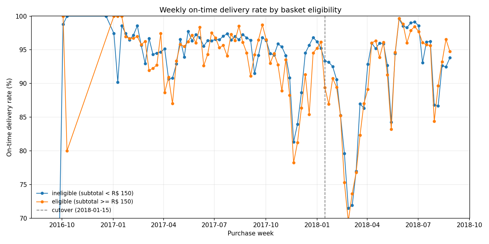

# Parallel-trends test for the DiD identification

The hierarchical Bayesian DiD model in §4.1 identifies the policy effect under the assumption that the pre-cutover on-time-delivery trends were parallel between the eligible (subtotal >= R$ 150) and ineligible cohorts. This document tests that assumption two ways: visually and via a formal pre-trend regression.

## Visual check



Both cohorts move broadly in parallel across the panel. The vertical dashed line marks the cutover week. Both cohorts also drop together at the right edge - that's the delivery-grace censoring (orders too recent to have a delivery outcome) and is filtered out of the modelling panel via the 6-week grace window in `src/features.py`.

## Formal pre-trend regression

Fitted on the pre-cutover window only:

```
logit(on_time_rate) = a + b*time + c*eligible + d*(time x eligible)
```

| Coefficient | Estimate | SE | p-value | Interpretation |
|---|---|---|---|---|
| `const`             | +3.9317 | 0.0928 | 0.0000 | baseline logit |
| `time`              | -0.0235 | 0.0017 | 0.0000 | common weekly trend |
| `eligible`          | -0.0486 | 0.1775 | 0.7844 | eligible vs ineligible level |
| **`time x eligible`** | **-0.0032** | 0.0032 | **0.3292** | **slope difference - parallel-trends test** |

Pre-period sample size: 46,774 orders across 58 weeks.

**Result: PARALLEL TRENDS CONSISTENT WITH DATA.** The slope difference `time x eligible` is -0.0032 logit-points per week with p = 0.329, which is not statistically distinguishable from zero at the 5% level. The DiD identification assumption is supported. Any residual non-parallelism is small enough that the +1.5 pp policy effect in §4.1 is unlikely to be a pre-trend artefact.
